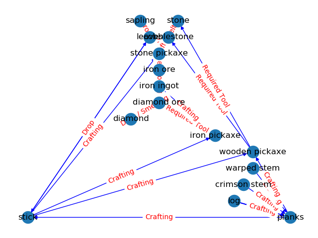

# minecraft-concept-net
Relational information extracted from Minecraft wiki-sources, A Minecraft Conceptnet for planning and reinforcement learning.

**crafting_data** is a json of the form:
<pre>
<code>"Wooden Pickaxe": {
"ingredients": [
["Oak Planks", "Oak Planks", "Oak Planks", "", "Stick", "", "", "Stick", ""],
["", "", "", "Wooden Pickaxe", "Wooden Pickaxe", "", "", "", ""]],
"type": "Tools"}</code></pre>

Where each ingredient element corresponds to a crafting slot. This data only includes crafting recipes.

**retrieve_dependencies.py** can be used to retrieve all the dependencies (drops/crafting/smelting data) for a given set of inputs. It does this my crawling the Minecraft wikipedia, extracting information from crafting/smelting panes, and also searching for textual information about material drops.

<code>python retrieve_dependencies.py diamond </code>

The above command saves recipes info into a json. For certain items with many dependencies, it will take a few minutes.

*Note that diamond ore is also related to diamond via "Drop," but the edge is obscured by the the smelt relation.

# TODO:
- Clean code
- Optimize
